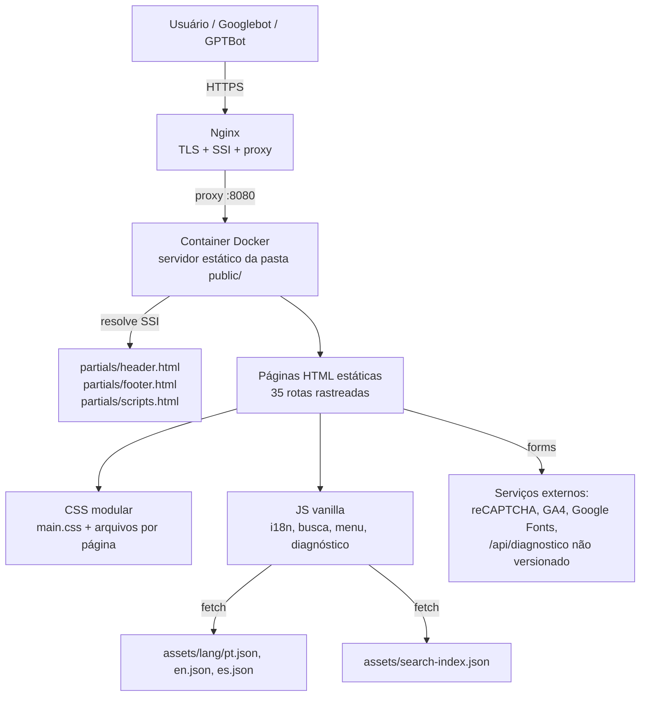

# 01 — Visão Geral

## Índice
- [O que é o projeto](#o-que-é-o-projeto)
- [Modelo de arquitetura](#modelo-de-arquitetura)
- [Diagrama de alto nível](#diagrama-de-alto-nível)
- [Domínios de conteúdo](#domínios-de-conteúdo)
- [O que este projeto NÃO é](#o-que-este-projeto-não-é)
- [Documentos relacionados](#documentos-relacionados)

## O que é o projeto

Tutela Digital® é o site institucional/jurídico de um serviço de **custódia probatória de ativos digitais** (preservação de prova digital com cadeia de custódia auditável, integridade técnica verificável e suporte à admissibilidade jurídica em processos judiciais, administrativos e arbitrais no Brasil). A empresa por trás do site é a Novaes & Coelho Ltda (CNPJ 00.810.662/0001-27), conforme identificado no rodapé (`public/partials/footer.html:46` e no bloco `application/ld+json` do tipo `Organization` no mesmo arquivo).

O repositório contém **apenas o site público** (marketing, conteúdo jurídico/educacional, formulário de diagnóstico de risco e link de saída para a plataforma transacional). A aplicação transacional em si roda em outro domínio, `https://app.tuteladigital.com.br/` (ver `public/partials/header.html:137`), e **não faz parte deste repositório**.

## Modelo de arquitetura

O projeto é um **site estático multi-página (MPA — Multi-Page Application)**, servido diretamente da pasta `public/`, sem build step, sem bundler, sem framework de frontend (não é Next.js, React, Vue, Astro, Jekyll, Hugo etc.). Isso é confirmado por várias evidências convergentes:

- `docs/ambientes-e-deploy.md:20,40`: *"O projeto é um site estático servido de `public/`... Não há build, gerenciador de pacotes nem testes automatizados versionados; HTML, CSS, JavaScript, partials, idiomas e assets são entregues diretamente."*
- `public/robots.txt:2`: comentário `# MPA Architecture - SEO Jurídico Nacional`.
- `public/assets/js/navigation.js:1-8`: script inteiro desativado com o comentário `NAVIGATION DISABLED (MPA MODE)` — evidência de que o site **migrou de uma SPA (Single Page Application) para MPA** em algum momento (ver [12-technical-debt.md](12-technical-debt.md)).
- Não existe `package.json` com dependências de framework, nem `next.config.js`, `vite.config.js`, `astro.config.mjs`, `tsconfig.json` em lugar nenhum do repositório.

A composição de página usa **Server Side Includes (SSI)** do próprio servidor web: cada página HTML referencia o cabeçalho, rodapé e scripts com `<!--#include virtual="/partials/header.html" -->` (ver `public/index.html:91,410-411`). Isso significa que o HTML runtime só existe depois que o servidor (Nginx, com o módulo `ssi on;`) processa o arquivo — o HTML bruto versionado em `public/*.html` nunca contém o header/footer completos, só o comentário de include. Isso é confirmado explicitamente pelo comentário em `.github/ci/build_search_index.py:104-112`, que precisa reconstruir esse comportamento manualmente para poder indexar o conteúdo do header/footer para a busca interna do site.

## Diagrama de alto nível

## Domínios de conteúdo

O site organiza o conteúdo em clusters temáticos claros, visíveis tanto na navegação (`public/partials/header.html`) quanto na estrutura de diretórios:

| Cluster | Rota raiz | Propósito |
| --- | --- | --- |
| Institucional/produto | `/`, `/como-funciona/`, `/seguranca/` | Proposta de valor, funcionamento, segurança técnica |
| Verticais de mercado | `/governo/`, `/empresas/`, `/pessoas/` | Páginas de solução por segmento de cliente |
| Ativos digitais (pillar page) | `/ativos-digitais/` e 4 subpáginas | Conteúdo jurídico aprofundado sobre ativos digitais |
| Insights (blog jurídico) | `/insights/ativos-digitais/`, `/insights/prova-digital/` | Artigos educacionais/SEO (13 artigos) |
| Base jurídica / legal | `/legal/*` | Termos de uso, privacidade, fundamentos jurídicos (7 páginas) |
| Ferramenta interativa | `/diagnostico/` | Questionário de autodiagnóstico de risco com formulário |
| Internacional | `/en/digital-assets/`, `/es/activos-digitales/`, `/pt/ativos-digitais/` | Páginas físicas traduzidas (apenas o pillar de ativos digitais) |

Ver inventário completo de rotas em [04-routing.md](04-routing.md).

## O que este projeto NÃO é

Para evitar suposições incorretas em trabalhos futuros:

- **Não é** uma aplicação Next.js/React/Vue — não há JSX, componentes de framework, virtual DOM ou build de frontend.
- **Não tem** gerenciamento de estado (Redux, Zustand, Context API) — não se aplica a um site estático MPA.
- **Não tem** autenticação de usuário no repositório — o login/autenticação acontece na plataforma separada `app.tuteladigital.com.br`, fora deste código.
- **Não tem** testes automatizados versionados, apesar de um `package.json` com `@playwright/test` estar presente no diretório de trabalho — ver [12-technical-debt.md](12-technical-debt.md).
- **Não tem** backend/API própria versionada neste repositório, apesar de `public/assets/js/diagnostico.js:294` fazer `fetch('/api/diagnostico', ...)`. Essa rota não tem implementação visível no repositório — necessita validação (provavelmente resolvida por proxy reverso do Nginx para um serviço externo, não versionado aqui).

## Documentos relacionados
- Stack completa: [02-stack.md](02-stack.md)
- Estrutura de arquivos: [03-folder-structure.md](03-folder-structure.md)
- Deploy e ambientes: [11-build-deploy.md](11-build-deploy.md)
