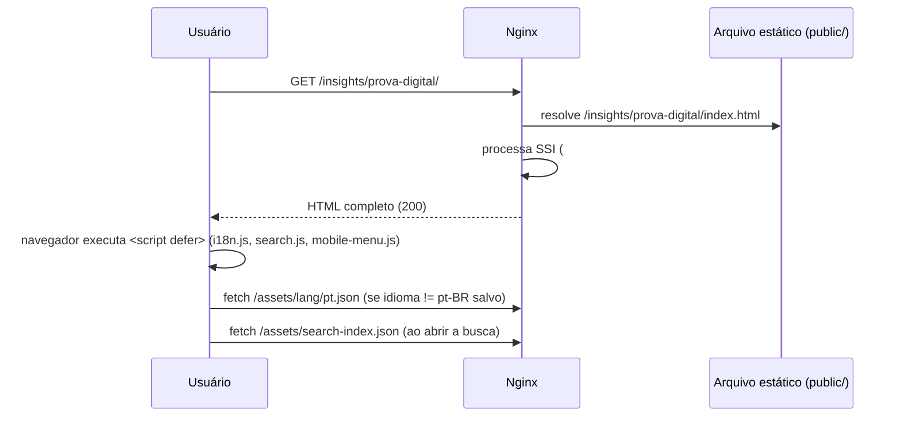

# 04 — Rotas e Roteamento

## Índice
- [Modelo de roteamento](#modelo-de-roteamento)
- [Regra de derivação de URL](#regra-de-derivação-de-url)
- [Tabela completa de rotas](#tabela-completa-de-rotas)
- [Redirecionamentos](#redirecionamentos)
- [Internacionalização de URL](#internacionalização-de-url)
- [Busca por hash (`#buscar=`)](#busca-por-hash-buscar)
- [Fluxo de uma requisição](#fluxo-de-uma-requisição)

## Modelo de roteamento

Não há roteador client-side (sem React Router, sem `history.pushState` para navegação — a única chamada a `history.replaceState` é para limpar o parâmetro `#buscar=` da URL após um resultado de busca, em `public/assets/js/search.js:72-74`). O roteamento é **inteiramente feito pelo servidor de arquivos estáticos**: cada URL corresponde a um arquivo físico em `public/`, resolvido pelas convenções normais de servidor web (`/caminho/` → `/caminho/index.html`).

## Regra de derivação de URL

A regra de derivação de URL a partir do caminho do arquivo está definida em dois lugares que precisam ficar sincronizados manualmente — ambos implementam a mesma lógica de forma independente:

1. `.github/workflows/sitemap.yml:33-42` (Bash, gera `sitemap.xml`)
2. `.github/ci/build_search_index.py:47-60` (Python, gera `search-index.json`)

Regra: 
- `index.html` (na raiz) → `/`
- `algo/index.html` → `/algo/`
- `algo.html` → `/algo/`

Isso explica por que páginas como `public/legal/institucional.html` (arquivo `.html` solto, sem pasta) resultam na URL `/legal/institucional/` — com barra final — e não em `/legal/institucional.html`.

## Tabela completa de rotas

| URL | Arquivo fonte | Cluster |
| --- | --- | --- |
| `/` | `public/index.html` | Home |
| `/como-funciona/` | `public/como-funciona.html` | Institucional |
| `/diagnostico/` | `public/diagnostico.html` | Ferramenta interativa |
| `/seguranca/` | `public/seguranca.html` | Institucional |
| `/governo/` | `public/governo.html` | Vertical |
| `/empresas/` | `public/empresas.html` | Vertical |
| `/pessoas/` | `public/pessoas.html` | Vertical |
| `/ativos-digitais/` | `public/ativos-digitais/index.html` | Pillar page |
| `/ativos-digitais/estrutura-juridica/` | `.../estrutura-juridica/index.html` | Pillar page |
| `/ativos-digitais/heranca-digital/` | `.../heranca-digital/index.html` | Pillar page |
| `/ativos-digitais/protecao-e-riscos/` | `.../protecao-e-riscos/index.html` | Pillar page |
| `/ativos-digitais/prova-digital-judicial/` | `.../prova-digital-judicial/index.html` | Pillar page |
| `/insights/` | `public/insights/index.html` | Blog (índice) |
| `/insights/ativos-digitais/` | `.../ativos-digitais/index.html` | Blog (categoria) |
| `/insights/ativos-digitais/compliance-lgpd/` | `.../compliance-lgpd/index.html` | Artigo |
| `/insights/ativos-digitais/custodia-ativos-digitais/` | `.../custodia-ativos-digitais/index.html` | Artigo |
| `/insights/ativos-digitais/marco-regulatorio/` | `.../marco-regulatorio/index.html` | Artigo |
| `/insights/ativos-digitais/o-que-sao-ativos-digitais/` | `.../o-que-sao-ativos-digitais/index.html` | **Stub de redirecionamento** (ver abaixo) |
| `/insights/ativos-digitais/sucessao-digital/` | `.../sucessao-digital/index.html` | Artigo |
| `/insights/prova-digital/` | `public/insights/prova-digital/index.html` | Blog (categoria) |
| `/insights/prova-digital/cadeia-custodia-prova-digital/` | `.../cadeia-custodia-prova-digital/index.html` | Artigo |
| `/insights/prova-digital/hash-criptografico-temporalidade/` | `.../hash-criptografico-temporalidade/index.html` | Artigo |
| `/insights/prova-digital/ia-custodia-qualificada/` | `.../ia-custodia-qualificada/index.html` | Artigo |
| `/insights/prova-digital/integridade-tecnica-admissibilidade/` | `.../integridade-tecnica-admissibilidade/index.html` | Artigo |
| `/insights/prova-digital/producao-antecipada-prova-digital/` | `.../producao-antecipada-prova-digital/index.html` | Artigo |
| `/insights/prova-digital/prova-digital-processo-civil-brasileiro/` | `.../prova-digital-processo-civil-brasileiro/index.html` | Artigo |
| `/legal/arquitetura-juridica-prova-digital/` | `.../arquitetura-juridica-prova-digital/index.html` | Legal |
| `/legal/fundamento-juridico/` | `.../fundamento-juridico/index.html` | Legal |
| `/legal/institucional/` | `public/legal/institucional.html` | Legal |
| `/legal/politica-de-privacidade/` | `public/legal/politica-de-privacidade.html` | Legal |
| `/legal/preservacao-probatoria-digital/` | `.../preservacao-probatoria-digital/index.html` | Legal |
| `/legal/termos-de-custodia/` | `public/legal/termos-de-custodia.html` | Legal |
| `/legal/termos-de-uso/` | `public/legal/termos-de-uso.html` | Legal |
| `/en/digital-assets/` | `public/en/digital-assets/index.html` | i18n (pillar) |
| `/es/activos-digitales/` | `public/es/activos-digitales/index.html` | i18n (pillar) |
| `/pt/ativos-digitais/` | `public/pt/ativos-digitais/index.html` | i18n (pillar, espelho PT) |
| `/prova-digital-validade-juridica/` | `public/prova-digital-validade-juridica/index.html` | Standalone — propósito atual necessita validação (não está no menu de navegação) |

Total: 35 rotas (confirmado por `git ls-files public | grep '\.html$' | grep -v partials`). O `sitemap.xml` versionado contém 37 `<url>` (pequena divergência não investigada a fundo — necessita validação, possivelmente por timing de geração).

## Redirecionamentos

Dois mecanismos de redirecionamento coexistem no repositório, **de plataformas diferentes**, para o mesmo conjunto de 4-5 URLs legadas (migração de páginas legais para `/legal/`):

**`public/_redirects`** (sintaxe Netlify):
```
/institucional.html  /legal/institucional.html  301
/fundamento-juridico.html  /legal/fundamento-juridico.html  301
/termos-de-custodia.html  /legal/termos-de-custodia.html  301
/politica-de-privacidade.html  /legal/politica-de-privacidade.html  301
/preservacao-probatoria-digital.html  /legal/preservacao-probatoria-digital.html  301
```

**`public/vercel.json`** (sintaxe Vercel), com as mesmas 4 primeiras regras (falta a de `preservacao-probatoria-digital.html`).

Como o ambiente de produção real roda em Nginx + Docker self-hosted (ver [11-build-deploy.md](11-build-deploy.md)), e não em Netlify nem Vercel, **nenhum desses dois arquivos é necessariamente respeitado em produção** — a aplicação real desses redirects depende da configuração do Nginx no servidor, que não é versionada. O próprio runbook de deploy admite essa lacuna: *"Os redirecionamentos legados também aparecem em `public/_redirects` e `public/vercel.json`; confirme que a camada realmente usada em produção os atende."* (`docs/ambientes-e-deploy.md:178`). Necessita validação. Ver também [12-technical-debt.md](12-technical-debt.md).

Além disso, existe um **redirecionamento client-side** (meta refresh + `window.location.replace`) na página `/insights/ativos-digitais/o-que-sao-ativos-digitais/`, que redireciona para `/insights/ativos-digitais/sucessao-digital.html` (nota: com extensão `.html` e sem a pasta correspondente, embora a URL real do artigo, segundo esta própria tabela, seja `/insights/ativos-digitais/sucessao-digital/`). O `<link rel="canonical">` dessa mesma página estática aponta para uma terceira variante (`.../o-que-sao-ativos-digitais.html`). O gerador do índice de busca já documenta esse comportamento como conhecido e o trata como exceção (`.github/ci/build_search_index.py:47-51,124-133`), excluindo páginas de redirecionamento do índice de busca.

## Internacionalização de URL

O site usa um **modelo híbrido** de i18n de URL:

1. **Maioria das páginas**: uma única URL em PT-BR (`<html lang="pt-BR">`), com o conteúdo trocado no cliente via `public/assets/js/i18n.js` (atributos `data-i18n`). A URL não muda quando o usuário troca de idioma pelo seletor de bandeiras.
2. **Pillar page de Ativos Digitais** (exceção): possui páginas físicas dedicadas por idioma, cada uma com `<html lang>` correto e um cluster completo de `hreflang`:
   - `/ativos-digitais/` (PT-BR, canônica "sem prefixo")
   - `/pt/ativos-digitais/` (PT-BR, espelho com prefixo — usado como alvo de `hreflang="pt-BR"`)
   - `/en/digital-assets/` (`<html lang="en">`)
   - `/es/activos-digitales/` (`<html lang="es">`)

Exemplo de bloco `hreflang` completo (`public/en/digital-assets/index.html:9-13`):
```html
<link rel="canonical" href="https://tuteladigital.com.br/en/digital-assets/" />
<link rel="alternate" hreflang="pt-BR" href="https://tuteladigital.com.br/pt/ativos-digitais/" />
<link rel="alternate" hreflang="en" href="https://tuteladigital.com.br/en/digital-assets/" />
<link rel="alternate" hreflang="es" href="https://tuteladigital.com.br/es/activos-digitales/" />
<link rel="alternate" hreflang="x-default" href="https://tuteladigital.com.br/ativos-digitais/" />
```
A página apontada como `x-default` (`/ativos-digitais/`) **não** declara, ela mesma, o cluster de `hreflang` recíproco — ver [07-seo.md](07-seo.md) e [12-technical-debt.md](12-technical-debt.md).

## Busca por hash (`#buscar=`)

O widget de busca (`public/assets/js/search.js`) não navega via API/AJAX para uma página de resultados própria — ele gera links diretos para a página de destino com um fragmento `#buscar=<termo>` (ex.: `/insights/prova-digital/#buscar=hash`). Ao carregar, `search.js` roda em **todas** as páginas (incluída via `partials/scripts.html`), procura esse fragmento, localiza a primeira ocorrência do termo no texto visível (incluindo header/footer, já resolvidos pelo SSI em runtime), envolve em `<mark>` e rola até ele — depois limpa o fragmento da URL com `history.replaceState`.

## Fluxo de uma requisição



## Documentos relacionados
- [07-seo.md](07-seo.md) — canonical, hreflang e sitemap em detalhe.
- [12-technical-debt.md](12-technical-debt.md) — inconsistências de redirecionamento e canonical.
