# 05 — Componentes

## Índice
- [O que "componente" significa neste projeto](#o-que-componente-significa-neste-projeto)
- [Árvore de composição de página](#árvore-de-composição-de-página)
- [Partials (includes SSI)](#partials-includes-ssi)
- [Controladores JavaScript](#controladores-javascript)
- [Componentes visuais reutilizáveis (CSS)](#componentes-visuais-reutilizáveis-css)
- [Padrões recorrentes de seção](#padrões-recorrentes-de-seção)
- [Reutilização e pontos fortes](#reutilização-e-pontos-fortes)
- [Oportunidades de melhoria observadas](#oportunidades-de-melhoria-observadas)

## O que "componente" significa neste projeto

Este não é um projeto baseado em componentes de framework (sem `.jsx`/`.vue`/`.astro`). "Componente" aqui significa um dos três tipos de unidade reutilizável realmente presentes no código:

1. **Partials de servidor** (SSI) — fragmentos HTML incluídos em todas as páginas.
2. **Controladores JavaScript** — módulos que anexam comportamento a seletores CSS já presentes no HTML.
3. **Classes CSS reutilizáveis** — "componentes visuais" (botões, cards) aplicados via `class=""` no HTML de cada página.

## Árvore de composição de página

```mermaid
graph TD
    Page["Página HTML (ex.: insights/.../index.html)"]
    Page --> Head["&lt;head&gt;<br/>meta tags, Schema.org, CSS específico da página"]
    Page --> HeaderInc["#include partials/header.html"]
    Page --> Main["&lt;main class='main'&gt;<br/>conteúdo específico da página"]
    Page --> FooterInc["#include partials/footer.html"]
    Page --> ScriptsInc["#include partials/scripts.html"]

    HeaderInc --> Logo[".logo"]
    HeaderInc --> Nav[".nav — nav-link + 4x .nav-dropdown"]
    HeaderInc --> Search[".search-widget"]
    HeaderInc --> LangSwitch[".lang-switch — 3x .lang-flag"]
    HeaderInc --> CTA[".header-cta → app.tuteladigital.com.br"]
    HeaderInc --> MobileBtn[".mobile-menu-btn"]

    FooterInc --> Brand[".tdf-brand-*"]
    FooterInc --> Contact[".tdf-contact — email, Instagram, YouTube"]
    FooterInc --> TrustPills[".tdf-trust-pill x5 — selos de confiança"]
    FooterInc --> OrgSchema["script application/ld+json — Organization"]
    FooterInc --> Whatsapp[".tdf-wa — botão flutuante WhatsApp"]

    ScriptsInc --> S1["mobile-menu.js"]
    ScriptsInc --> S2["dropdown-menu.js"]
    ScriptsInc --> S3["i18n.js"]
    ScriptsInc --> S4["search.js"]
```



## Partials (includes SSI)

Localizados em `public/partials/`, incluídos via `<!--#include virtual="/partials/NOME.html" -->`. **Não são rotas navegáveis** — são resolvidos pelo Nginx no momento da requisição (ver [01-overview.md](01-overview.md)).

| Partial | Usado em | Responsabilidade |
| --- | --- | --- |
| `header.html` | Todas as 35 páginas | Logo, navegação principal com 4 dropdowns, seletor de idioma, busca, CTA para a plataforma, menu mobile. Também injeta preconnect + `<link>` de fontes Google via script inline (guard `global-fonts-loaded` evita duplicar). |
| `footer.html` | Todas as 35 páginas | Marca, contatos, selos de confiança, Schema.org `Organization`, botão flutuante do WhatsApp. |
| `scripts.html` | Todas as 35 páginas | Declaração centralizada dos 4 scripts globais (`mobile-menu.js`, `dropdown-menu.js`, `i18n.js`, `search.js`), todos com `defer` e query string de cache-busting por data. |
| `ativos-digitais-pillar-main.html` | Páginas do cluster `/ativos-digitais/` (via inclusão dentro do próprio HTML, não SSI) | Markup compartilhado do template "pillar page" editorial. |
| `ativos-digitais-pillar-styles.html` | Idem | Bloco `<style>` inline com tokens próprios `--ux-*` (ver [06-design-system.md](06-design-system.md)) para o template editorial. |
| `ativos-digitais-pillar-scripts.html` | Idem | Comentário indicando que a animação de revelação é mantida "sem inicialização manual de I18N". |

**Dependência de infraestrutura crítica**: o SSI só funciona se o servidor web tiver o suporte habilitado (`ssi on;` no Nginx). Isso não é validável a partir do repositório — necessita validação direta no servidor (ver [11-build-deploy.md](11-build-deploy.md)).

## Controladores JavaScript

Cada script é um módulo autoexecutável (IIFE) com guarda de reinicialização (`window.__algoInitialized`), carregado globalmente em todas as páginas via `scripts.html` — não há carregamento condicional por rota.

| Script | Finalidade | Depende de | Observações |
| --- | --- | --- | --- |
| `i18n.js` | Motor de tradução: carrega `i18n-config.json` e `lang/{lang}.json`; aplica `data-i18n*`; expõe `window.I18N` | `fetch` para `/assets/config/i18n-config.json` e `/assets/lang/*.json` | Trata páginas `legal-page` de forma especial: só traduz strings de interface (nav/footer/modal), preservando o conteúdo jurídico em PT-BR e exibindo um aviso (`legal-lang-notice`) quando o idioma ativo não é `pt` (`i18n.js:74-192`). |
| `mobile-menu.js` | **Controlador real** de navegação: abre/fecha os 4 `.nav-dropdown` (hover no desktop, clique no mobile), menu hambúrguer, estado ativo do link atual, troca de idioma pelo clique na bandeira, mudança de cor da borda do header ao rolar | Seletores `.nav-dropdown`, `.mobile-menu-btn`, `#nav`, `#header`, `.lang-flag` | Apesar do nome sugerir "só mobile", também controla os dropdowns desktop — ver nota de nomenclatura em [12-technical-debt.md](12-technical-debt.md). |
| `dropdown-menu.js` | Historicamente controlava dropdowns; hoje é apenas uma "ponte" que emite `console.warn` se `mobile-menu.js` não rodou antes | `window.__tutelaNavigationControllerInitialized` | Mantido apenas como salvaguarda de ordem de carregamento — não implementa lógica própria. |
| `navigation.js` | Desativado (`return` logo no topo) | — | Vestígio da arquitetura SPA anterior à migração para MPA. |
| `search.js` | Widget de busca: abre/fecha painel, debounce de 150ms, busca em título/descrição/corpo/texto global via `search-index.json`, realce (`<mark>`) e navegação por hash `#buscar=` | `fetch /assets/search-index.json`, `window.I18N` (opcional, para strings de UI) | Roda em toda página, mesmo sem o widget visível — a função de destaque de trecho ao chegar via link de busca é independente do widget. |
| `diagnostico.js` | Lógica completa da ferramenta `/diagnostico/`: navegação por 4 passos, cálculo de score de risco, modal de política de privacidade (carregada via `fetch` da página legal), reCAPTCHA v2 dinâmico por idioma, envio do formulário | `fetch /api/diagnostico` (endpoint não presente neste repositório — ver [09-security.md](09-security.md)), `grecaptcha`, `window.I18N` | Único script específico de uma única página. |
| `legal-animations.js` | Scroll-reveal (via `IntersectionObserver`) restrito a páginas com `body.legal-page` | Classes `.text-block`, `.features`, `.cta-final`, `.page-header` | Efeito visual isolado, sem acoplamento com i18n ou navegação. |

## Componentes visuais reutilizáveis (CSS)

| Componente | Arquivo | Classes principais |
| --- | --- | --- |
| Botões | `components/buttons.css` | `.btn`, `.btn-primary` (pílula, com `:focus-visible` definido) |
| Botões de hero | `pages-consolidated.css` / `homepage.css` | `.btn-hero-primary`, `.btn-hero-secondary` |
| Cards de feature | `components/cards.css` | `.feature-item`, `.feature-icon` |
| Cards de vertical (home) | `homepage.css` | `.vertical-card--new` |
| Cards de pilar (home) | `homepage.css` | `.pillar-card` |
| Hero de seção | `sections/hero.css` | `.hero`, `.hero-content--homepage`, `.hero-metrics` |
| Grid de features | `layout/layout.css` | `.features-grid`, `.features-grid--security` (com breakpoints próprios) |
| Cabeçalho de página legal | `pages-consolidated.css` / `legal-shared.css` | `.page-header`, `.page-header--legal` |
| Trust pills (rodapé) | `sections/footer.css` | `.tdf-trust-pill` |

## Padrões recorrentes de seção

Analisando `public/index.html` como referência de template, o padrão de seção é consistente entre páginas institucionais:

```html
<section class="section-NOME reveal">
  <p class="section-label" data-i18n="...">Rótulo curto</p>
  <h2 data-i18n="...">Título da seção</h2>
  <p data-i18n="...">Parágrafo de apoio</p>
  <!-- grid de cards / conteúdo específico -->
</section>
```

A classe `.reveal` é observada por um `IntersectionObserver` inline (duplicado em cada página que a usa — ex. `public/index.html:422-441` — não centralizado em um arquivo `.js` compartilhado), que adiciona `.visible` quando a seção entra na viewport.

## Reutilização e pontos fortes

- Header, footer e scripts são **de fato únicos** (via SSI) — qualquer alteração de navegação ou rodapé propaga para as 35 páginas automaticamente, sem duplicação de HTML.
- O sistema de tokens (`--color-*`, `--font-*`, `--space-*`) é referenciado consistentemente pelos componentes de `components/` e `layout/`.
- `i18n.js` e `search.js` são desacoplados de qualquer página específica — funcionam por convenção de atributos/IDs, permitindo reuso sem registro manual.

## Oportunidades de melhoria observadas

(Documentadas sem correção, conforme escopo desta análise — detalhamento e severidade em [12-technical-debt.md](12-technical-debt.md)):
- Nomenclatura de scripts não reflete responsabilidade real (`mobile-menu.js` controla também o desktop; `dropdown-menu.js` não controla mais dropdowns).
- O snippet do `IntersectionObserver` de `.reveal` está duplicado inline por página, em vez de centralizado em um arquivo compartilhado.
- Existem três sistemas de design tokens paralelos (global, `--ad-*`, `--ux-*`) — ver [06-design-system.md](06-design-system.md).

## Documentos relacionados
- [06-design-system.md](06-design-system.md) — tokens usados por estes componentes.
- [08-performance.md](08-performance.md) — impacto do carregamento global (não condicional) dos scripts.
