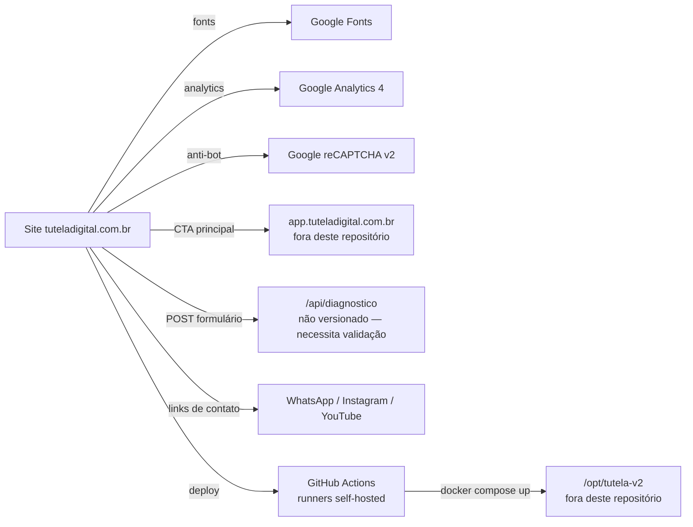

# 10 — Dependências

## Índice
- [Dependências internas (npm)](#dependências-internas-npm)
- [Bibliotecas de terceiros no frontend](#bibliotecas-de-terceiros-no-frontend)
- [Serviços de terceiros integrados](#serviços-de-terceiros-integrados)
- [Dependências de CI/CD](#dependências-de-cicd)
- [Dependências implícitas de infraestrutura](#dependências-implícitas-de-infraestrutura)
- [Matriz de acoplamento externo](#matriz-de-acoplamento-externo)

## Dependências internas (npm)

O `package.json` da raiz contém uma única entrada:

```json
{
  "devDependencies": {
    "@playwright/test": "^1.61.1"
  }
}
```

Não há `dependencies` (produção). `package.json`, `package-lock.json` e a pasta `node_modules/` (ignorada via `.gitignore:1`) não estão rastreados pelo Git no momento da análise — são artefatos locais do ambiente de trabalho, não parte do código publicado. Não há `playwright.config.*` nem arquivos `*.spec.*`/`*.test.*` em lugar nenhum do repositório, então esta dependência não está, no momento, conectada a nenhum teste executável (ver [12-technical-debt.md](12-technical-debt.md)).

## Bibliotecas de terceiros no frontend

**Nenhuma.** Não há jQuery, Lodash, Alpine.js, htmx, GSAP, Swiper, ou qualquer outra biblioteca JS de terceiros importada nas páginas. Todo o JavaScript do site (`public/assets/js/*.js`) é vanilla, escrito à mão. Não identificado no projeto.

Da mesma forma, não há framework/biblioteca CSS de terceiros (sem Bootstrap, Tailwind, Bulma) — o CSS é autoral, com o design system próprio descrito em [06-design-system.md](06-design-system.md).

## Serviços de terceiros integrados

| Serviço | Tipo de integração | Onde | Dado trocado |
| --- | --- | --- | --- |
| Google Fonts | `<link>` CSS externo | `public/partials/header.html`, `foundation/tokens.css` | Nenhum dado do usuário enviado além do User-Agent/IP padrão de qualquer requisição HTTP |
| Google Analytics 4 (`gtag.js`) | `<script async>` | Todas as páginas via `<head>`, ex. `public/index.html:46-54` | Eventos de pageview/analytics; `linker` configurado entre `tuteladigital.com.br` e `app.tuteladigital.com.br` para cross-domain tracking |
| Google reCAPTCHA v2 | `<script>` + widget | `public/diagnostico.html:289` | Verificação anti-bot no formulário de diagnóstico |
| Instagram / YouTube | Links `<a>` diretos (sem SDK/embed) | `public/partials/footer.html:22-37` | Nenhum — apenas hyperlinks |
| WhatsApp Business | Link direto `wa.me` | `public/partials/footer.html:91` | Nenhum — apenas hyperlink com número fixo |
| e-Notariado | Menção institucional apenas (parceiro citado no conteúdo) | `public/index.html:191-193` | Nenhuma integração técnica no repositório |
| `app.tuteladigital.com.br` | Link de saída (CTA principal) | `public/partials/header.html:137` | Nenhum dado trocado neste repositório — aplicação separada |
| `/api/diagnostico` | `fetch` client-side | `public/assets/js/diagnostico.js:294` | Nome, e-mail, score do diagnóstico, token do reCAPTCHA — **implementação do endpoint não está neste repositório** |

## Dependências de CI/CD

`.github/workflows/*.yml` dependem de:
- `actions/checkout@v4` (única action de marketplace usada, em `sitemap.yml` e `guard-main-requires-homolog.yml`)
- Runners **self-hosted** rotulados `[self-hosted, homolog]` e `[self-hosted, production]` — infraestrutura própria, fora do controle do GitHub, necessária para os workflows de deploy funcionarem.
- Runner `ubuntu-latest` hospedado pelo GitHub, usado apenas pelos workflows `sitemap.yml` e `guard-main-requires-homolog.yml` (que não tocam infraestrutura própria).
- `python3` (stdlib apenas — `json`, `re`, `glob`, `html`) para gerar o índice de busca (`.github/ci/build_search_index.py`) — nenhuma dependência PyPI declarada ou necessária.
- `docker compose` no servidor (versão não fixada no repositório — definição do Compose vive fora, em `/opt/tutela-v2`).

## Dependências implícitas de infraestrutura

Estas não aparecem como "dependência" em nenhum manifesto, mas o site **não funciona corretamente sem elas**:

| Dependência implícita | Por quê é necessária | Evidência |
| --- | --- | --- |
| Servidor com suporte a SSI (`ssi on;`) | Header, footer e scripts só aparecem no HTML final se o servidor resolver `<!--#include virtual="..." -->` | Todas as páginas usam esse padrão; comentário em `build_search_index.py:104-112` descreve a mecânica |
| Roteamento de `/caminho/` → `/caminho/index.html` | Todas as URLs "limpas" do site dependem dessa convenção padrão de servidor de arquivos | Tabela de rotas em [04-routing.md](04-routing.md) |
| Backend por trás de `/api/diagnostico` | O formulário de diagnóstico depende de um serviço que recebe o POST | `diagnostico.js:294`; não versionado neste repositório |

## Matriz de acoplamento externo



## Documentos relacionados
- [02-stack.md](02-stack.md) — visão consolidada da stack.
- [11-build-deploy.md](11-build-deploy.md) — como as dependências de CI/CD se encaixam no pipeline.
- [09-security.md](09-security.md) — riscos associados a dependências não auditáveis (`/api/diagnostico`).
