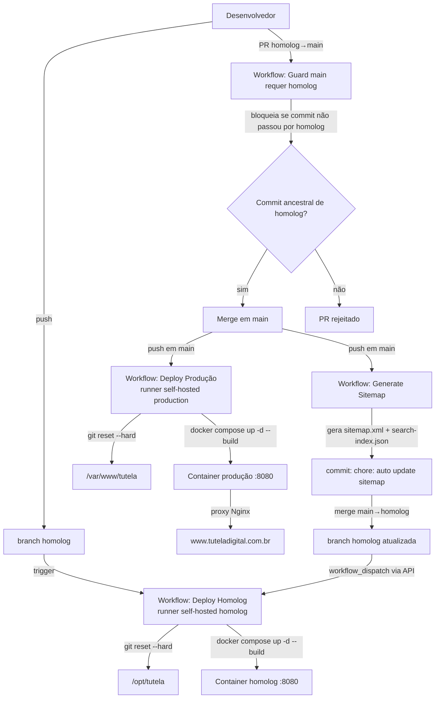
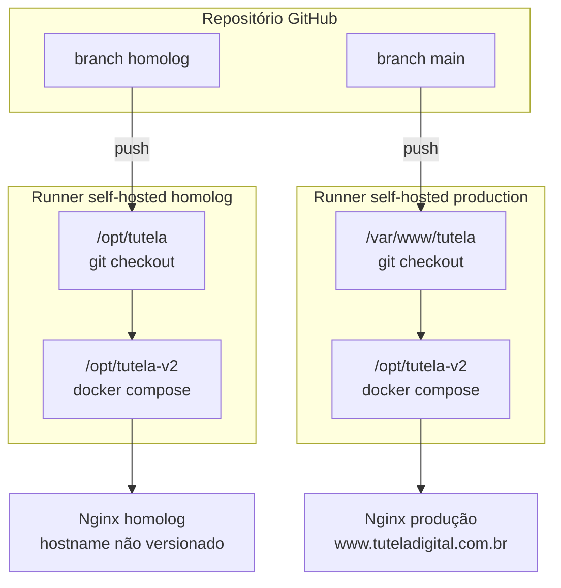

# 11 — Build e Deploy

## Índice
- [Resumo](#resumo)
- [Não há build](#não-há-build)
- [Ambientes](#ambientes)
- [Pipeline de deploy](#pipeline-de-deploy)
- [Workflow: Deploy Homolog](#workflow-deploy-homolog)
- [Workflow: Deploy Produção](#workflow-deploy-produção)
- [Workflow: Guard main requer homolog](#workflow-guard-main-requer-homolog)
- [Workflow: Sitemap](#workflow-sitemap)
- [Nginx](#nginx)
- [Rollback](#rollback)
- [Diagrama consolidado](#diagrama-consolidado)

## Resumo

O pipeline de build/deploy está descrito em detalhe no runbook pré-existente [`docs/ambientes-e-deploy.md`](../ambientes-e-deploy.md), que já é a fonte de verdade operacional do time. Este documento resume e cruza essa informação com o que foi observado diretamente nos workflows (`.github/workflows/*.yml`), sem duplicar o runbook por completo — consulte-o para os comandos de auditoria e resposta a incidentes.

## Não há build

Não existe etapa de build/compilação. O deploy consiste em colocar o conteúdo de `public/` (e o restante do repositório) em produção via `git reset --hard` seguido de `docker compose up -d --build` — o `--build` do Compose reconstrói a imagem do container (provavelmente um servidor estático simples), não "compila" o site em si.

## Ambientes

| Ambiente | Branch | Checkout no servidor | Gatilho | Hostname confirmado |
| --- | --- | --- | --- | --- |
| Local | árvore de trabalho | — | manual (`python3 -m http.server 8080 --directory public`) | `localhost:8080` |
| Homologação | `homolog` | `/opt/tutela` | push em `homolog` | não versionado — necessita validação |
| Produção | `main` | `/var/www/tutela` | push em `main` | `www.tuteladigital.com.br` (confirmado no sitemap e conteúdo) |

## Pipeline de deploy



## Workflow: Deploy Homolog

Arquivo: `.github/workflows/deploy-homolog.yml`. Disparado por push em `homolog` ou manualmente (`workflow_dispatch`). Roda em runner `[self-hosted, homolog]`:

```bash
cd /opt/tutela
git fetch origin
git reset --hard origin/homolog

cd /opt/tutela-v2
docker compose up -d --build
```

**Nota de segurança operacional**: `git reset --hard` descarta qualquer alteração manual feita diretamente no checkout do servidor — o runbook alerta explicitamente contra editar arquivos ali como forma de "publicação rápida" (`docs/ambientes-e-deploy.md:59`).

## Workflow: Deploy Produção

Arquivo: `.github/workflows/deploy-prod.yml`. Disparado apenas por push em `main` (sem `workflow_dispatch` manual). Roda em runner `[self-hosted, production]`:

```bash
cd /var/www/tutela
git fetch origin
git reset --hard origin/main

cd /opt/tutela-v2
docker compose up -d --build
```

Nota: o diretório do Compose (`/opt/tutela-v2`) é o **mesmo caminho lógico** citado no workflow de homolog, mas em servidores físicos/runners diferentes — cada runner self-hosted tem seu próprio `/opt/tutela-v2` local.

## Workflow: Guard main requer homolog

Arquivo: `.github/workflows/guard-main-requires-homolog.yml`. Roda em `ubuntu-latest` (hospedado pelo GitHub, não self-hosted) em todo PR contra `main`. Verifica, via `git merge-base --is-ancestor`, se o commit do PR já é ancestral da branch `homolog` — ou seja, **impõe tecnicamente** a política "toda mudança precisa passar por homolog antes de chegar a main". Se não for ancestral, o job falha com uma mensagem explicando o fluxo correto. Esta é uma salvaguarda de processo bem desenhada, implementada como CI gate em vez de depender de disciplina manual da equipe.

## Workflow: Sitemap

Arquivo: `.github/workflows/sitemap.yml`. Disparado por push em `main`, `homolog`, `feature/legal-structure`, ou manualmente. Roda em `ubuntu-latest`. Passos:
1. Regenera `public/sitemap.xml` do zero, iterando `git ls-files` (não o disco), com a lógica de prioridade/frequência detalhada em [07-seo.md](07-seo.md).
2. Executa `.github/ci/build_search_index.py` para regenerar `public/assets/search-index.json`.
3. Comita as mudanças como `chore: auto update sitemap`, usando a identidade `github-actions` e faz push na própria branch que disparou o workflow (`git push origin HEAD`).
4. **Apenas se o push foi em `main`**: faz merge de `origin/main` em `homolog` e push.
5. Dispara manualmente o workflow `deploy-homolog.yml` via API (`workflow_dispatch`), porque pushes feitos com o `GITHUB_TOKEN` automático não disparam outros workflows por proteção anti-recursão do GitHub — o comentário no próprio YAML (`sitemap.yml`, linhas finais) documenta esse detalhe não-óbvio e por que o disparo explícito é necessário.

**Observação de processo, já sinalizada pelo próprio runbook**: essa sincronização automática vai de **main para homolog**, o oposto do fluxo de validação usual (que seria validar em homolog antes de promover a main). O runbook já registra isso como pendência de revisão da equipe (`docs/ambientes-e-deploy.md:99`). Ver também [12-technical-debt.md](12-technical-debt.md).

## Nginx

A configuração Nginx ativa **não é versionada neste repositório** — é gerenciada diretamente nos servidores (`docs/ambientes-e-deploy.md:116-118`). O que se sabe, a partir do runbook e das evidências no conteúdo do site:
- Deve suportar SSI (necessário para o funcionamento do site, ver [05-components.md](05-components.md)) — necessita validação, pois esse requisito não está documentado explicitamente no runbook atual.
- Deve fazer proxy para `127.0.0.1:8080` (porta do container) — a confirmar.
- Hostname canônico de produção: `www.tuteladigital.com.br`.
- Redirecionamentos legados (`public/_redirects`, `public/vercel.json`) só têm efeito real se replicados na configuração Nginx — o runbook pede confirmação explícita disso.

## Rollback

Segundo o runbook (`docs/ambientes-e-deploy.md:180-189`): rollback é feito com um **novo commit revertendo o commit problemático** na branch do ambiente afetado — não por manipulação manual do checkout do servidor, já que o próximo deploy sempre sobrescreve com `git reset --hard origin/<branch>`.

## Diagrama consolidado



## Documentos relacionados
- [docs/ambientes-e-deploy.md](../ambientes-e-deploy.md) — runbook operacional completo (comandos de auditoria, incidentes).
- [13-development-workflow.md](13-development-workflow.md) — fluxo de trabalho do desenvolvedor do início ao fim.
- [12-technical-debt.md](12-technical-debt.md) — pendências de processo já sinalizadas.
