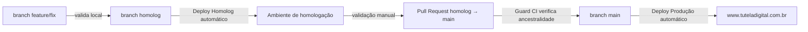

# 13 — Fluxo de Desenvolvimento

## Índice
- [Ambiente local](#ambiente-local)
- [Fluxo de branches](#fluxo-de-branches)
- [Checklist antes de publicar](#checklist-antes-de-publicar)
- [Convenções de código observadas](#convenções-de-código-observadas)
- [Ausência de testes automatizados](#ausência-de-testes-automatizados)
- [Ferramentas do assistente de IA no repositório](#ferramentas-do-assistente-de-ia-no-repositório)

## Ambiente local

Segundo `docs/ambientes-e-deploy.md:32-40`, o ambiente local requer apenas Git, Python 3 e um navegador — **não há `npm install` necessário** para rodar o site (a única dependência declarada em `package.json`, Playwright, não é usada por nenhum script de execução local). O site deve ser servido via HTTP, nunca aberto como `file://`:

```bash
python3 -m http.server 8080 --directory public
```

Acesso: `http://localhost:8080/`. Como o servidor embutido do Python **não implementa SSI**, o `<!--#include virtual="..." -->` de header/footer/scripts **não é resolvido localmente** dessa forma — o desenvolvedor veria o comentário de include cru em vez do header/footer renderizado. Isso não é mencionado explicitamente no runbook e é registrado aqui como uma lacuna prática: necessita validação sobre qual servidor local (com suporte a SSI) a equipe efetivamente usa para pré-visualizar mudanças de header/footer antes de publicar.

## Fluxo de branches



1. Trabalho em branch de feature/fix, validado localmente.
2. Integração em `homolog` — dispara o workflow **Deploy Homolog** automaticamente.
3. Validação manual na URL de homologação: navegação, responsividade, console do navegador, HTTPS, páginas legais, sitemap, CTAs (`docs/ambientes-e-deploy.md:55`).
4. Abertura de PR de `homolog` para `main`. O workflow **Guard - main requer homolog** (`.github/workflows/guard-main-requires-homolog.yml`) bloqueia o merge se o commit ainda não for ancestral de `homolog` — barreira técnica, não apenas de processo.
5. Merge em `main` dispara o workflow **Deploy Produção** automaticamente.
6. Validação em produção assim que a execução terminar.

Ver [11-build-deploy.md](11-build-deploy.md) para o detalhamento técnico de cada workflow, incluindo a sincronização automática (main → homolog) feita pelo workflow de sitemap.

## Checklist antes de publicar

Extraído do runbook (`docs/ambientes-e-deploy.md:42-47`):
- Testar as URLs afetadas em desktop e mobile.
- Conferir links e redirecionamentos.
- Se mudar chaves de idioma, validar `public/assets/lang/pt.json`, `en.json` e `es.json`.
- Executar `git diff --check` (detecta conflitos de merge não resolvidos e espaços em branco problemáticos) e conferir `git status`.

## Convenções de código observadas

- **Comentários como changelog inline**: várias seções de `public/index.html` (e presumivelmente outras páginas) documentam correções específicas diretamente no HTML como comentários `<!-- FIX v6: ... -->` (ex. `public/index.html:96-100,151-158,218-225`), explicando por que uma classe ou chave de `data-i18n` foi alterada. Isso funciona como um changelog de proximidade (a explicação fica ao lado do código afetado), mas não é limpo posteriormente — o histórico de "por que mudou" acumula no próprio arquivo de produção em vez de ficar só no histórico do Git.
- **Guardas de reinicialização em JS**: todo script vanilla usa um padrão consistente de `window.__algoInitialized` para evitar múltiplas inicializações caso o script seja incluído mais de uma vez (`search.js:2-3`, `mobile-menu.js:1-6`).
- **Nomenclatura de arquivos CSS por página**: os arquivos em `assets/css/pages/` seguem o padrão `<nome-da-rota>.css`, facilitando localizar o estilo de uma página específica pelo nome da URL.
- **Versionamento manual de assets**: ver inconsistência de esquemas de cache-busting documentada em [08-performance.md](08-performance.md) e [12-technical-debt.md](12-technical-debt.md).

## Ausência de testes automatizados

Não há suíte de testes automatizados versionada — nem unitários, nem E2E, nem de regressão visual. `docs/ambientes-e-deploy.md:40` confirma isso explicitamente: *"Não há build, gerenciador de pacotes nem testes automatizados versionados"*. A validação de qualidade descrita no runbook é **inteiramente manual** (checklist acima). A presença de `@playwright/test` como dependência não rastreada (ver [10-dependencies.md](10-dependencies.md) e [12-technical-debt.md](12-technical-debt.md)) sugere uma tentativa de introduzir testes E2E que não chegou a ser commitada.

## Ferramentas do assistente de IA no repositório

A pasta `.claude/` (não rastreada pelo Git) contém configuração local do assistente Claude Code usado no desenvolvimento deste projeto (permissões de comando, etc.) — é tooling de ambiente de trabalho, não parte do produto, e está fora do escopo desta documentação de arquitetura.

## Documentos relacionados
- [docs/ambientes-e-deploy.md](../ambientes-e-deploy.md) — runbook operacional completo.
- [11-build-deploy.md](11-build-deploy.md) — detalhamento técnico dos workflows de CI/CD.
- [12-technical-debt.md](12-technical-debt.md) — pendências relacionadas a testes e processo.
