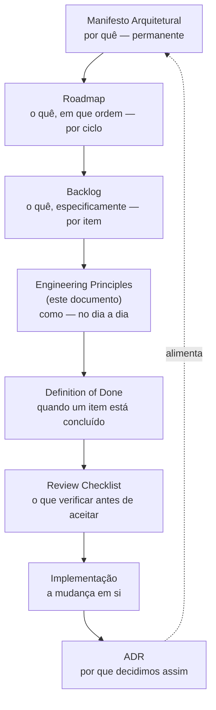

# 18 — Engineering Principles

# Objetivo

Este documento responde a uma pergunta prática: **como desenvolvemos software neste projeto, dia a dia?**

Ele traduz os valores e princípios permanentes do [Manifesto Arquitetural](../architecture/17-architectural-manifesto.md) em práticas de engenharia objetivas — regras que podem ser seguidas, verificadas e ensinadas, independentemente de quem está trabalhando no projeto em um determinado momento.

Este documento **não define princípios arquiteturais** — isso é papel exclusivo do Manifesto, e nada aqui deve ser lido como uma tentativa de estabelecer um princípio novo ou de reinterpretar um já existente. Este documento também não define prioridades de negócio (papel do Roadmap) nem itens de trabalho rastreáveis (papel do Backlog). Ele define **como** o trabalho é feito, assumindo que o **porquê** (Manifesto), o **em que ordem** (Roadmap) e o **o quê** (Backlog) já estão resolvidos em outro lugar.

Sempre que uma prática descrita aqui parecer entrar em conflito com um princípio do Manifesto, o Manifesto prevalece — este documento existe para servir aos princípios, não para competir com eles.

---

# Relação com os demais documentos

A documentação deste projeto forma uma cadeia, em que cada elo depende do anterior e prepara o seguinte:

- O **Manifesto** estabelece o que nunca deve deixar de ser verdade sobre este projeto.
- O **Roadmap** prioriza, para um ciclo específico, quais frentes recebem atenção primeiro.
- O **Backlog** decompõe essas frentes em itens individualmente executáveis e verificáveis.
- **Este documento (Engineering Principles)** estabelece como qualquer um desses itens deve ser executado na prática — as regras de código, commit, refatoração, teste e documentação que se aplicam independentemente de qual item do backlog está sendo trabalhado.
- A **Definition of Done** aplica essas regras a um item específico, definindo objetivamente quando ele pode ser considerado concluído.
- O **Review Checklist** é a verificação final, aplicada por quem revisa uma mudança antes de aceitá-la.
- A **Implementação** é a mudança em si, guiada por tudo o que vem antes na cadeia.
- O **ADR** registra, depois que uma decisão relevante foi tomada durante esse processo, por que ela foi tomada daquela forma — e esse registro, com o tempo, alimenta de volta o Manifesto, quando uma decisão se mostra permanente o suficiente para se tornar princípio.

Este documento não substitui nenhum elo da cadeia — ele é um elo específico dela, e só faz sentido lido em conjunto com os demais.

---

# PRINCÍPIOS DE ENGENHARIA

### EP-01 — Código Simples

| Campo | Conteúdo |
|---|---|
| Objetivo | Garantir que qualquer trecho de código seja compreensível sem esforço desproporcional. |
| Regra | Prefira a solução mais direta que resolve o problema atual; não introduza abstração, camada ou generalização que o requisito de hoje não exige. |
| Motivação | Código simples é mais fácil de revisar, testar e corrigir; complexidade prematura resolve problemas que ainda não existem, ao custo de tornar tudo mais difícil de entender agora. |
| Exemplo correto | Uma função que resolve exatamente o caso de uso pedido, sem parâmetros ou ramificações para cenários hipotéticos. |
| Exemplo incorreto | Um mecanismo de configuração genérico criado para um único uso atual, "para o caso de precisarmos no futuro". |

### EP-02 — Responsabilidade Única

| Campo | Conteúdo |
|---|---|
| Objetivo | Garantir que cada arquivo, script ou componente tenha um único motivo para mudar. |
| Regra | Um arquivo deve ter uma responsabilidade clara e nomeável; se descrevê-lo exige "e" ("faz X e também Y"), ele provavelmente deve ser dividido. |
| Motivação | Responsabilidades misturadas tornam qualquer mudança arriscada — alterar um comportamento acaba afetando outro, não relacionado, sem aviso. |
| Exemplo correto | Um script dedicado exclusivamente ao comportamento de navegação, com nome que reflete essa única responsabilidade. |
| Exemplo incorreto | Um script cujo nome sugere uma responsabilidade restrita, mas que também controla, na prática, um comportamento inteiramente diferente. |

### EP-03 — Baixo Acoplamento

| Campo | Conteúdo |
|---|---|
| Objetivo | Reduzir o quanto uma mudança em uma parte do projeto força mudanças em outras partes não relacionadas. |
| Regra | Componentes se comunicam por contratos explícitos (atributos, seletores, nomes previsíveis), nunca por conhecimento implícito da implementação interna uns dos outros. |
| Motivação | Acoplamento alto transforma qualquer alteração pequena em uma mudança de risco amplo e difícil de prever. |
| Exemplo correto | Um script que reage à presença de um atributo ou classe no HTML, sem precisar saber como ou por que esse atributo foi definido. |
| Exemplo incorreto | Um script que só funciona corretamente se outro script específico já tiver rodado antes, sem que essa dependência esteja declarada em lugar nenhum. |

### EP-04 — Evitar Duplicação

| Campo | Conteúdo |
|---|---|
| Objetivo | Impedir que a mesma regra, valor ou lógica exista em mais de um lugar do projeto. |
| Regra | Antes de copiar algo, extraia-o para um único lugar compartilhado e reaproveite-o a partir dali. |
| Motivação | Duplicação garante divergência com o tempo: mais cedo ou mais tarde uma cópia é atualizada e a outra não. |
| Exemplo correto | Um valor de identidade visual definido uma única vez como token e referenciado em todos os lugares que o usam. |
| Exemplo incorreto | O mesmo valor escrito por extenso em múltiplos arquivos, com pequenas variações que ninguém decidiu deliberadamente. |

### EP-05 — Remover Código Morto

| Campo | Conteúdo |
|---|---|
| Objetivo | Impedir que código sem função ativa permaneça indefinidamente no projeto. |
| Regra | Ao confirmar, com evidência verificável (ex.: busca em todo o repositório), que um trecho não é mais referenciado, ele é removido no mesmo ciclo em que essa confirmação acontece — não adiado para depois. |
| Motivação | Código morto confunde quem lê o projeto depois, e pode ser reativado ou copiado por engano, achando que ainda está em uso. |
| Exemplo correto | Remoção de um script assim que se confirma, por busca no repositório inteiro, que nenhuma página o referencia. |
| Exemplo incorreto | Manter um script inteiro desativado "só por precaução", sem revisão nem prazo para removê-lo. |

### EP-06 — Commits Pequenos

| Campo | Conteúdo |
|---|---|
| Objetivo | Tornar cada mudança individualmente revisável e reversível. |
| Regra | Um commit corresponde a uma única unidade lógica de mudança, com mensagem que explica o quê e o porquê; mudanças não relacionadas vão em commits separados. |
| Motivação | Commits grandes escondem múltiplas decisões dentro de uma só entrega, dificultando revisão e reversão seletiva. |
| Exemplo correto | Um commit que só ajusta a nomenclatura de um arquivo, sem misturar nenhuma outra alteração de comportamento. |
| Exemplo incorreto | Um commit único que renomeia arquivos, corrige um problema não relacionado e ajusta estilo visual ao mesmo tempo. |

### EP-07 — Mudanças Incrementais

| Campo | Conteúdo |
|---|---|
| Objetivo | Reduzir o risco de qualquer mudança individual. |
| Regra | Divida uma mudança grande em etapas menores, cada uma verificável e entregável de forma independente, em vez de acumular tudo em uma única entrega. |
| Motivação | Uma mudança pequena que falha é fácil de diagnosticar; uma mudança grande que falha esconde a causa entre dezenas de alterações simultâneas. |
| Exemplo correto | Consolidar um sistema de tokens de cor em uma etapa, e só depois, separadamente, tokenizar breakpoints. |
| Exemplo incorreto | Reescrever tokens de cor, breakpoints e nomenclatura de arquivos inteiros em uma única entrega. |

### EP-08 — Refatoração Separada de Funcionalidade

| Campo | Conteúdo |
|---|---|
| Objetivo | Impedir que uma melhoria de forma e uma mudança de comportamento se tornem indistinguíveis. |
| Regra | Uma mudança é refatoração (forma) ou é funcionalidade (comportamento) — nunca as duas ao mesmo tempo, no mesmo commit ou na mesma entrega. |
| Motivação | Misturar as duas torna impossível reverter uma sem reverter a outra, e dificulta identificar qual delas causou um problema. |
| Exemplo correto | Um commit que só reorganiza a estrutura interna de um script, seguido de um commit separado que adiciona um comportamento novo. |
| Exemplo incorreto | Um commit que ao mesmo tempo reescreve a estrutura de um componente e muda o que ele faz para quem usa o site. |

### EP-09 — Sem Efeitos Colaterais Ocultos

| Campo | Conteúdo |
|---|---|
| Objetivo | Garantir que o efeito de uma mudança seja previsível a partir de sua descrição. |
| Regra | Uma alteração não produz um efeito não relacionado ao seu propósito declarado sem que esse efeito esteja explicitamente registrado na mudança. |
| Motivação | Efeitos colaterais escondidos são a causa mais comum de regressões descobertas tarde, longe da mudança que as causou. |
| Exemplo correto | Uma alteração que documenta explicitamente que também ajusta um comportamento relacionado, e explica por quê. |
| Exemplo incorreto | Uma correção pontual em um arquivo compartilhado que, sem aviso, também muda o comportamento de outra página que o usa. |

### EP-10 — Documentação Sincronizada

| Campo | Conteúdo |
|---|---|
| Objetivo | Garantir que a documentação nunca descreva um estado que já deixou de ser verdade. |
| Regra | Uma mudança que altera o que a documentação descreve só é considerada concluída quando a documentação correspondente também é atualizada, na mesma entrega. |
| Motivação | Documentação desatualizada é pior do que nenhuma documentação — ela engana com aparência de autoridade. |
| Exemplo correto | Uma mudança de comportamento entregue junto com a atualização do documento que o descrevia. |
| Exemplo incorreto | Uma mudança de comportamento entregue com a atualização da documentação prometida "para depois". |

### EP-11 — Nomenclatura Consistente

| Campo | Conteúdo |
|---|---|
| Objetivo | Garantir que o nome de um arquivo, função ou classe comunique corretamente sua responsabilidade real. |
| Regra | Um nome é revisado sempre que a responsabilidade do que ele nomeia muda; um nome que engana é tratado como defeito, não como detalhe cosmético. |
| Motivação | Um nome errado direciona quem lê o projeto para o lugar errado, gerando duplicação ou correção no arquivo equivocado. |
| Exemplo correto | Um arquivo cujo nome corresponde exatamente ao que ele faz, sem exigir explicação adicional. |
| Exemplo incorreto | Um arquivo cujo nome sugere uma responsabilidade restrita, mas que na prática também controla um comportamento mais amplo e diferente. |

### EP-12 — Arquivos Pequenos e Coesos

| Campo | Conteúdo |
|---|---|
| Objetivo | Manter cada arquivo fácil de ler por completo, sem exigir navegação extensa para entendê-lo. |
| Regra | Quando um arquivo passa a acumular responsabilidades não relacionadas, ele é dividido antes de crescer ainda mais — não depois que já se tornou difícil de navegar. |
| Motivação | Arquivos grandes escondem responsabilidades diferentes em um único lugar, dificultando localizar exatamente o que precisa mudar. |
| Exemplo correto | Um arquivo dedicado a uma única responsabilidade, pequeno o suficiente para ser lido por completo rapidamente. |
| Exemplo incorreto | Um único arquivo que acumula estilos de múltiplas páginas não relacionadas, "porque já existia" e era o caminho de menor esforço. |

### EP-13 — Dependências Justificadas

| Campo | Conteúdo |
|---|---|
| Objetivo | Garantir que toda dependência externa tenha um motivo declarado e continue sendo necessária. |
| Regra | Nenhuma dependência é adicionada sem registrar por que é necessária; dependências existentes são revisitadas periodicamente para confirmar se essa necessidade continua válida. |
| Motivação | Dependências sem justificativa acumulam risco e custo de manutenção sem benefício correspondente. |
| Exemplo correto | Uma dependência adicionada com uma nota explicando qual problema específico ela resolve. |
| Exemplo incorreto | Uma dependência instalada e nunca conectada a nada, permanecendo no projeto sem que ninguém confirme se ainda é necessária. |

### EP-14 — Reutilização Antes de Criação

| Campo | Conteúdo |
|---|---|
| Objetivo | Evitar a criação de algo novo quando algo equivalente já existe no projeto. |
| Regra | Antes de criar um componente, padrão ou utilitário novo, procure ativamente por um equivalente já existente e reaproveite-o ou estenda-o. |
| Motivação | Criar em vez de reaproveitar multiplica o número de formas diferentes de resolver o mesmo problema, cada uma exigindo manutenção separada. |
| Exemplo correto | Estender um componente visual já existente para cobrir um caso novo, em vez de criar um equivalente do zero. |
| Exemplo incorreto | Um segundo sistema de definição de identidade visual criado em paralelo ao já existente, porque localizar e entender o original pareceu mais trabalhoso. |

### EP-15 — Preferir Composição

| Campo | Conteúdo |
|---|---|
| Objetivo | Reduzir duplicação e acoplamento através de reaproveitamento estrutural, não de cópia. |
| Regra | Elementos usados por múltiplas partes do projeto são extraídos para um único lugar e incluídos onde forem necessários — nunca copiados manualmente. |
| Motivação | Composição garante, pela própria estrutura, que uma mudança em um elemento compartilhado se propaga para todo lugar que o usa, sem esforço adicional. |
| Exemplo correto | Um cabeçalho definido uma única vez e incluído por composição em todas as páginas que o usam. |
| Exemplo incorreto | O mesmo bloco de marcação colado manualmente em cada página que precisa dele. |

### EP-16 — Evitar Configurações Mágicas

| Campo | Conteúdo |
|---|---|
| Objetivo | Impedir que valores ou comportamentos importantes fiquem escondidos sem explicação. |
| Regra | Todo valor que afeta comportamento de forma não óbvia é nomeado e explicado — nunca deixado como um número ou texto solto sem contexto. |
| Motivação | Um valor "mágico" obriga quem lê o código a adivinhar seu significado ou a descobri-lo por tentativa e erro. |
| Exemplo correto | Um limite de responsividade definido como um valor nomeado, documentado e reutilizado a partir de um único lugar. |
| Exemplo incorreto | Múltiplos valores numéricos soltos, espalhados por diferentes arquivos, sem que nenhum explique por que aquele número específico foi escolhido. |

### EP-17 — Não Introduzir Dívida Técnica Sem Registrá-la

| Campo | Conteúdo |
|---|---|
| Objetivo | Garantir que toda dívida técnica criada seja conhecida e rastreável, mesmo quando aceita deliberadamente. |
| Regra | Se uma mudança introduz uma simplificação, um atalho ou uma limitação conhecida, isso é registrado no backlog rastreável no mesmo momento em que a mudança é entregue — nunca depois, nunca informalmente. |
| Motivação | Dívida técnica não registrada é indistinguível de um erro não intencional; a diferença entre as duas é justamente o registro. |
| Exemplo correto | Uma limitação aceita conscientemente, documentada com sua causa e um item correspondente aberto no backlog. |
| Exemplo incorreto | Um atalho tomado sob pressão de prazo, sem nenhum registro de que ele existe. |

---

# REGRAS DE IMPLEMENTAÇÃO

**Como criar novos arquivos.** Um arquivo novo só é criado quando nenhum arquivo existente pode razoavelmente absorver a responsabilidade em questão (ver EP-14). Seu nome descreve sua responsabilidade real, não sua localização ou o momento em que foi criado.

**Quando modificar arquivos existentes.** Sempre que a responsabilidade em questão já pertence a um arquivo existente. Modificar é preferível a duplicar, mesmo quando parece mais rápido copiar e ajustar.

**Quando criar componentes.** Quando um padrão visual, estrutural ou de comportamento se repete, ou é reconhecidamente necessário em mais de um lugar. Um componente criado para um único uso, sem repetição prevista, é complexidade antecipada (ver EP-01).

**Quando reutilizar componentes.** Sempre que o caso de uso se encaixa em um componente existente, mesmo que exija um ajuste pequeno nele. A extensão de algo existente é sempre avaliada antes da criação de algo novo (EP-14).

**Quando dividir arquivos.** Quando um arquivo passa a conter responsabilidades que não compartilham o mesmo motivo de mudança (EP-02, EP-12) — não em função de um número de linhas específico, mas da coesão real do conteúdo.

**Quando criar novos diretórios.** Quando um agrupamento de arquivos relacionados deixa de fazer sentido dentro da estrutura existente. Novos diretórios refletem uma categoria real do projeto, não uma tentativa de "arrumar" arquivos que não sabem bem onde deveriam estar.

**Quando remover código.** Assim que se confirma, com evidência verificável, que ele não tem mais função ativa (EP-05). A remoção é parte da mesma entrega que confirma essa ausência de uso, não uma tarefa futura separada.

**Quando remover dependências.** Assim que se confirma que uma dependência não está mais conectada a nenhuma funcionalidade ativa, ou que seu propósito original deixou de existir (EP-13).

**Quando criar documentação.** Sempre que uma mudança afeta o que um documento existente descreve, ou introduz um comportamento, decisão ou convenção que uma pessoa futura precisaria conhecer para trabalhar corretamente no projeto.

---

# REGRAS DE REFATORAÇÃO

**O que caracteriza uma refatoração.** Uma mudança é refatoração quando altera a forma interna de algo sem alterar seu comportamento observável por quem usa o projeto. Se o resultado visível ou funcional muda, não é refatoração — é uma mudança de funcionalidade, e deve ser tratada e comunicada como tal (EP-08).

**Quando ela deve ocorrer.** Quando a forma atual de algo está ativamente dificultando uma mudança necessária, ou quando uma inconsistência identificada (ex.: nomenclatura, duplicação) começa a gerar risco real de erro. Refatoração não é um fim em si mesma — ela se justifica por um problema concreto que resolve.

**Como reduzir risco.** Uma refatoração é sempre acompanhada de uma forma de confirmar, depois de aplicada, que o comportamento observável permaneceu idêntico ao anterior — seja por verificação manual sistemática, seja por cobertura automatizada equivalente. Refatorações em partes do projeto usadas por todas as páginas (ex.: elementos compartilhados) recebem verificação proporcional ao alcance do que tocam.

**Como dividir grandes refatorações.** Cada etapa de uma refatoração grande deve, isoladamente, deixar o projeto em um estado consistente e funcional — nunca um estado intermediário quebrado que só faz sentido depois da etapa seguinte. Se uma refatoração não pode ser dividida dessa forma, ela provavelmente está tentando fazer mudanças demais de uma vez (EP-07).

**Como medir sucesso.** Uma refatoração é bem-sucedida quando: (a) o comportamento observável não mudou de forma não intencional; (b) a forma resultante é objetivamente mais simples, mais consistente ou menos duplicada do que a anterior; e (c) alguém que não participou da refatoração consegue confirmar as duas afirmações anteriores apenas revisando o resultado.

---

# REGRAS PARA TESTES

**Quando criar testes.** Ao implementar ou alterar um fluxo crítico — aquele cuja falha silenciosa afetaria diretamente quem usa o site (navegação, troca de idioma, envio de formulário, busca) — um teste automatizado correspondente é criado ou atualizado como parte da mesma entrega, não como tarefa futura.

**Quando atualizar testes.** Sempre que uma mudança altera intencionalmente um comportamento já coberto por teste automatizado. Um teste que passa apesar de o comportamento ter mudado de propósito não está protegendo nada — está apenas desatualizado.

**Quando testes são obrigatórios.** Para qualquer mudança em um dos fluxos críticos do site (ver acima) e para qualquer refatoração de código usado por todas as páginas — justamente onde o custo de uma regressão não percebida é maior.

**Quando testes podem ser adiados.** Para mudanças de conteúdo isoladas (texto, imagem, página nova sem lógica própria) e para correções cujo escopo é comprovadamente local e de baixo risco. "Adiado" não significa "dispensado indefinidamente" — significa que a cobertura automatizada não é pré-condição para aquela entrega específica.

**Papel do Playwright.** É a camada de verificação automatizada de regressão para os fluxos críticos do site — a ferramenta prevista para confirmar, de forma repetível, que uma mudança não quebrou um comportamento que já funcionava antes dela. Sua configuração inicial é, ela própria, um item do backlog rastreável (ver `docs/architecture/16-architecture-backlog.md`, ARQ-501); até que essa cobertura exista e seja ampla o suficiente, seu papel é assumido pela verificação manual descrita abaixo.

**Papel dos testes manuais.** Cobrem o que a automação ainda não cobre, e continuam existindo mesmo depois que a cobertura automatizada crescer — para validação exploratória, verificação visual e confirmação de julgamento humano (ex.: uma página "parece certa") que um teste automatizado não substitui por natureza. O checklist de publicação já praticado neste projeto (testar URLs afetadas, conferir redirecionamentos, validar chaves de idioma) é a forma atual desse papel.

---

# REGRAS PARA DOCUMENTAÇÃO

**Quando atualizar documentação existente.** Sempre que uma mudança tornar uma afirmação de um documento existente desatualizada — o documento é atualizado na mesma entrega que causou a desatualização (EP-10), não depois.

**Quando criar um ADR.** Quando uma decisão relevante é tomada — uma escolha entre alternativas reais, com trade-offs, que uma pessoa futura poderia questionar ou reverter sem saber por que foi feita daquela forma. Decisões operacionais triviais, sem alternativa real considerada, não precisam de ADR.

**Quando atualizar o Backlog.** Sempre que um item é iniciado, concluído, bloqueado, cancelado ou quando uma dívida técnica nova é identificada durante o trabalho (EP-17). O Backlog reflete o estado real do trabalho, não um plano estático.

**Quando atualizar o Roadmap.** Quando a prioridade relativa entre frentes de trabalho muda de forma deliberada — não a cada item concluído, mas quando a ordem ou o escopo de um épico inteiro deixa de refletir a intenção atual do projeto.

**Quando atualizar o Manifesto.** Raramente, e apenas quando um princípio permanente precisa ser adicionado, esclarecido ou — em último caso — revisto. Mudar o Manifesto é uma decisão de maior peso que qualquer outra nesta cadeia, e deveria, ela mesma, estar acompanhada de um ADR que explique por quê.

**Quem é responsável.** Quem realiza uma mudança é responsável por atualizar a documentação que essa mudança afeta, no momento em que a realiza. Documentação desatualizada é tratada como parte incompleta do trabalho, não como uma tarefa separada de "depois".

---

# REGRAS PARA AGENTES DE IA

Esta seção se aplica a qualquer agente de IA que proponha ou implemente mudanças neste projeto.

**Como um agente deve trabalhar.** Seguindo os princípios de engenharia descritos neste documento com o mesmo rigor esperado de qualquer pessoa que contribui ao projeto — nenhuma regra aqui é relaxada por a mudança ter sido proposta por um agente de IA em vez de uma pessoa.

**Como propor mudanças.** Pela menor alteração suficiente para resolver o problema real identificado, dividida em etapas verificáveis quando o escopo for maior que trivial (EP-07). Uma proposta de mudança explicita o que muda, o que não muda e por que o escopo foi delimitado daquela forma.

**Como justificar alterações.** Toda alteração não trivial é acompanhada de uma explicação do problema que resolve, das alternativas consideradas quando existirem, e do porquê da abordagem escolhida — na forma esperada pelas regras de documentação acima.

**Como consultar documentação.** Antes de implementar, o agente de IA verifica: (a) se o Manifesto estabelece um princípio aplicável à área que será alterada; (b) se o Backlog já contém um item relacionado ao que está sendo feito; (c) se um ADR já existe explicando uma decisão relevante para aquela área. Implementar sem essa consulta prévia é tratado como uma falha de processo, mesmo que o resultado técnico esteja correto.

**Como evitar criar padrões paralelos.** Antes de introduzir uma forma nova de resolver um problema, o agente de IA verifica se um padrão equivalente já existe no projeto (EP-14) e o utiliza, salvo justificativa explícita e registrada de por que o padrão existente não serve. Um padrão novo introduzido sem essa verificação é considerado uma regressão de consistência, mesmo que tecnicamente funcione.

**Como agir diante de dúvidas.** Quando uma mudança depende de uma decisão que este documento, o Backlog ou o Manifesto não resolvem com clareza — especialmente quando ela toca uma das Decisões Inegociáveis do Manifesto — o agente de IA expõe a dúvida e as alternativas a uma pessoa responsável, em vez de decidir sozinho e seguir adiante.

---

# O QUE ESTE DOCUMENTO NÃO É

- **Não é o Manifesto.** Não estabelece princípios permanentes nem valores arquiteturais — assume os do Manifesto como dados e trabalha a partir deles.
- **Não é um Guia de Estilo.** Não define convenções de formatação, indentação ou sintaxe específicas de uma linguagem — isso pertence a um guia de estilo dedicado, se e quando um for criado.
- **Não é a Definition of Done.** Não define o critério objetivo de conclusão de um item específico do backlog — apenas as práticas gerais que qualquer item deve seguir enquanto é executado.
- **Não é o Review Checklist.** Não lista os itens pontuais a conferir antes de aceitar uma mudança específica — define os princípios que esse checklist, quando existir, deveria verificar.
- **Não é um ADR.** Não registra uma decisão específica tomada em um momento específico, com suas alternativas e seu contexto — registra regras gerais válidas para qualquer decisão futura desse tipo.
- **Não é o Backlog.** Não lista o que falta fazer, com prioridade ou prazo — descreve como qualquer item, presente ou futuro, deve ser executado.
